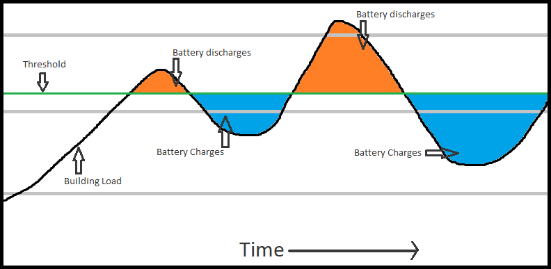

# Response  

## Algorithms
I tried several different approaches to solve the problem.
* find_minimum_capacity_iterative - Finds the minimum battery capacity with an iterative approach using base 10 step approximation.
* find_minimum_capacity_recursive - Finds the minimum battery capacity with a recursive approach using base 10 step approximation.
* find_threshold_iterative - Finds the minimum threshold given a battery capacity with an iterative approach using base 10 step approximation.
* find_threshold_recursive - Finds the minimum threshold given a battery capacity with a recursive approach using base 10 step approximation.
* find_threshold_bin - Finds the minimum threshold given a battery capacity with binary search approach.

`main.py` has the final usage of the algorithms that are run for the objectives.

## Prerequisites
* Python Version: `3.6.x`  
* Install Requirements: `pip3 install -r requirements.txt`

## Usage
To run all objects use command `python main.py load_data.csv` in the project's directory.

Each of these objectives are default on.
The objectives can be toggled off with using the following tags respectively:  
`'-ob1 f'` - To turn off objective 1.  
`'-ob2 f'` - To turn off objective 2.  
`'-ob3 f'` - To turn off objective 3.  
  
ex: `python main.py load_data.csv -ob1 f -ob2 f -ob3 f`

## Speed
Excluding data validation, results for all the objectives were able to  
be had within a range of 4.5 - 6.5 seconds on the machine under test.

## Test  
1. Navigate to the `tests/` directory
2. If `nose` is not already installed, run `pip3 install nose`
3. Run `nosetests`  

# Control System Exercise

## Exercise
You are given a CSV file with two columns. The first column is a timestamp, and the second column is a kWh value (a measurement of energy). Each row represents how much energy that has been consumed by the building in the 15-minute interval ending at the timestamp.

For example, `2015-01-01 00:00:00",8.899` means 8.899 kWh has been consumed in the 15-minute interval starting at 2014-12-31 23:45:00 and ending at 2015-01-01 00:00:00.

### First objective 

Assume you are given a lithium-ion battery with 100kWh capacity. You can either lower the energy consumption of the building by discharging the battery, or increase the energy consumption of the building by charging the battery.
Limit the energy consumption of the building at every 15-minute interval to a certain threshold. Find the lowest threshold that you can set for every month.

Assumptions for the first objective:
* Threshold resets at the beginning of each month.
* Battery charge level resets to 100% at the beginning of each month.
* The battery can either be charged, discharged, or stay idle during every 15-minute interval.
* There is no limit on the charge/discharge rate.
* Don't worry about charge/discharge inefficiencies.

### Second objective
Find the size of the lithium-ion battery that is needed to maintain a constant threshold of 20kWh each month.

Assumptions for the second objective:
* Battery charge level starts at 100%.
* Battery charge level resets to 100% at the beginning of each month.
* The battery can either be charged, discharged, or stay idle during every 15-minute interval.
* There is no limit on the charge/discharge rate.
* Don't worry about charge/discharge inefficiencies.

### Third objective
Find the size of the lithium-ion battery that is needed to maintain a constant threshold of 50kWh for all of the time in the input file.

Assumptions for the second objective:
* Battery charge level starts at 100% and does not reset every month.
* The battery can either be charged, discharged, or stay idle during every 15-minute interval.
* There is no limit on the charge/discharge rate.
* Don't worry about charge/discharge inefficiencies.

### Additional notes
* We prefer the use of Python for this exercise, which is a focus for this role.
* Provide your submission using python modules (.py) and not in Jupyter notebook format.
* Feel free to use any additional packages that you feel best fit for the solution.
* We are interested in your skills with object oriented programming, algorithms, data structures, testing, and coding style. Please demonstrate these skills to the best of your abilities.

Please also provide an additional notes or details needed to setup or run your submission.

## Output

* Please output the first objective result to a CSV file named `minimum_threshold.csv` using the same format provided in `sample_output.csv`. 
* Please output the second objective result to a CSV file named `minimum_capacity.csv` using the same format provided in `sample_output.csv` except the results should be provided as a whole number (rounded).
* Please output the third objective result in a text file named `50kwh_threshold_battery_size.txt`

